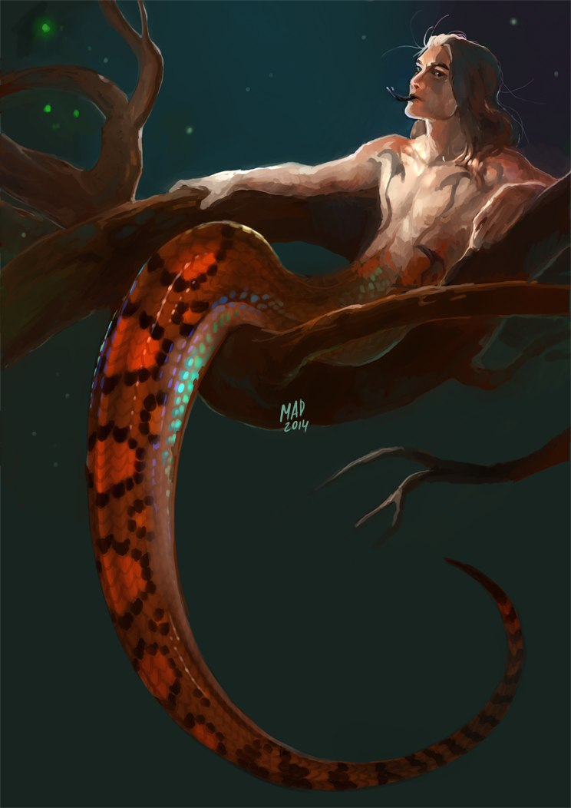

.. page:: watermark=background.png padding=10 margin=0.4in
.. section:: stack stack:columns=3
.. title:: banner style=title
.. block:: emphasis=big

**Apollo**
==========================

.. title:: hidden

.. image:: 13thAgelogo.png
   :height: 34
   :align: left
..

.. block:: style=default

- Race: **Naga**     |   Class: **Bard/Wizard** |   **Male**   |   Age:**97**
- *Becomes insubstantial when he sleeps*

.. block:: thermometer thermometer:rows=3 thermometer:style=therm_green emphasis=italic style=stat_style

Attributes
 - Strength     | **8**  | -1
 - Constitution | **10** | 0
 - Dexterity    | **10** | 0
 - Intelligence | **18** | +4
 - Wisdom       | **12** | +1
 - Charisma     | **18** | +4

.. block:: thermometer thermometer:rows=3 thermometer:style=therm_red style=stat_style

Defenses
 - AC | **14**
 - PD | **12**
 - MD | **18**

---------------------------------------------------------------

.. section:: stack stack:columns=2

.. title:: banner style=heading_blue
.. block:: style=blue

Level **2**         -- Initiative **+1**
  - Recoveries: [ ][ ][ ][ ][ ][ ][ ][ ] **2d8** • Advances: -- [[         ]]

Hits: **26**                            --  Staggered: **13**
 - [[                     ]]

---------------------------------------------------------------

.. section:: stack stack:columns=3 padding=10
.. block:: style=very_rough
.. title:: hidden

Picture

..

.. title:: banner style=heading_blue
.. block:: style=blue

Icon Relationships
 - The Three  | ? ?
 - Prince of Shadows | +

Backgrounds
 - Studied under the great dragon mage Asparax          --  3
 - Singer of Flattering Songs                           --  3
 - Wake Islands Swim and Slither Relay Team Champion    --  2

Racial Features
 - **Amphibious**: Can move and fight in water as well as a flying creature can in open air.
   Hold breath for up to 10 minutes
 - **Confounding**: Once per battle, when I roll a natural 16+ with an attack, also daze the target
   until the end of your next turn

Class Features
 - **Cantrips**: Cast a number of cantrips equal to int each battle
 - **Overworld Advantage**: In the overworld, daily spells become recharge 16+
 - **Ritual Magic**: Cast spells as rituals

Talents
 - **Jack of Spells** (Bard): Choose one spell from another class (Cleric: Turn Undead)
 - **Spellsinger** (Bard): Extra bardic song or spell
 - **High Arcana** (Wizard): Can double prepare spells; gain *Counterspell*

.. title:: banner style=heading_green
.. block:: style=green

Battle Chant (1) -- At-Will
 - **Bardic Spell**            --      **Nearby**
 - **Target**: One Enemy       --      **Attack**: +6 vs MD
 - **Hit**: d6 + 4 Thunder damage
 - **Effect**: Battle chant attack triggers felixible attacks

Melee Basic Attack -- At-Will
 - **Standard Action**      --      **Nearby**
 - **Target**: One Creature --      **Attack**: +2 vs AC
 - **Hit**: 2d6 (shortsword)--      **Miss**: level damage

Ranged Basic Attack -- At-Will
 - **Standard Action**      --      **Nearby**
 - **Target**: One Creature --      **Attack**: +2 vs AC
 - **Hit**: 2d6 (bow)       --      **Miss**: level damage

.. title:: banner style=heading_orange
.. block:: style=orange

Pull It Together -- Encounter [][]
 - **Flexible Attack**      --      **Trigger**: Natural 11+ melee
 - **Effect**: One nearby ally can heal using a recovery.

Move It! -- At Will
 - **Flexible Attack**      --      **Trigger**: Natural even roll
 - **Effect**: An engaged ally can disengaged, or an unengaged allty can move as a free action

.. title:: banner style=heading_red
.. block:: style=red

Cantrip (1) -- Encounter [][][][]
 - **Wizard spell** -- **Reference**: Page 151
 - **Options**: Alarm, Arcane Mark, Ghost Sound, Knock, Light, Mage Hand, Mending, Prestidigitation, Spark

Song of Heroes (1) -- Recharge 11+ [ ]
 - **Bardic Song**             --      **Nearby**
 - **Initial**: Quick Action   --      **Sustain**: Quick Action 11+
 - **Opening & Sustained Effect**: You and nearby allies gain a +1 attack bonus until the start of your next turn.
 - **Final Verse**:  The effect ends immediately, but one ally of your choice gains a +2 bonus to their next attack.

Shield (1) -- Recharge 11+ [ ]
 - **Close-quarters wizard spell** -- **Free Action**
 - **Trigger**: An attack hits your AC
 - **Effect**: Attacker must re-roll attack

Counter-magic (1) -- Encounter []
 - **Close-quarters wizard spell** -- **Free Action**
 - **Trigger**: A nearby creature you can see casts a spell.
 - **Target**: The nearby creature casting a spell.
 - **Attack**: +6 vs. MD
 - **Hit**: The target’s spell is canceled, and the caster loses the action they were using for the spell.
   If the spell had a limited use, that use is expended if your natural attack roll is even.

Color Spray (1) -- Cyclical []
 - **Close-quarters wizard spell** -- **Standard Action**
 - **Target**: 1d4 nearby enemies in a group
 - **Attack**: +6 vs. MD
 - **Hit**: 2d8 psychic damage, and if the target has 10 hp or fewer
   after the damage, it is weakened until the end of your next turn.

.. title:: banner style=heading_black
.. block:: style=black

Song of Spilt Blood (1) -- Daily [ ]
 - **Bardic Song**             --      **Nearby**
 - **Initial**: Quick Action   --      **Sustain**: Quick Action 6+
 - **Opening & Sustained Effect**: Attacks against you takes a penalty equal to the number of allies who have more hit points than you
 - **Final Verse**:  The effect ends immediately; you or an ally can heal using a recovery

Utility (1) -- Daily []
 - **Wizard spell** -- **Reference**: Page 147
 - **Disguise Self** -- Makes a disguise attempt one step easier (+5). Lasts 10 minutes
 - **Feather Fall** -- Gently fall to the ground (max 2 rnds)
 - **Hold Portal** -- Holds door for 10 minutes. Champion-tier creatures can batter it down (see rules)

Charm Person (1) -- Daily []
 - **Ranged wizard spell** -- **Standard Action**
 - **Target**: One nearby creature with 40 hp or fewer not in combat
 - **Attack**: +6 vs. MD
 - **Hit**: The target believes you are their friend until you or your allies take hostile action against them

Acid Arrow (1) -- Daily []
 - **Ranged wizard spell** -- **Standard Action**
 - **Target**: One nearby or far away creature
 - **Attack**: +6 vs. MD
 - **Hit**: 4d10 acid damage, and 5 ongoing acid damage.
 - **Miss**: 5 ongoing acid damage, and you regain the spell during your next quick rest

Turn Undead (1) -- Daily [ ]
 - **Standard Action**      --      **Nearby**
 - **Target**: 1d4 nearby undead creatures, each with 55 hp or fewer
 - **Attack**: +7 vs MD
 - **Hit**: The target is dazed until end of your next turn.
 - **Hit by 4+**: 1d10 x your level holy damage, and the target is dazed until end of your next turn.
 - **Hit by 8+**: Holy damage equal to half the target’s maximum hit points, and the target is dazed (save ends).
 - **Hit by 12+ or Natural 20**: The target is destroyed.

.. title:: banner style=heading_blue
.. block:: style=blue

Leather Surcoat -- Normal Armor
 - Tight-fitting tooled leather armor
 - Light armor improves AC, MD

Misc Items
 - Silk rope, Climbing kit, lantern, chalk
 - Sketch book, charcoal, pencils
 - Pan pipes

Feats
 - Adventurer: Battle Chant (damage is d6 instead of d4)

---------------------------------------------------------------

.. section:: stack stack:columns=1
.. title:: banner style=heading_green

Characters
 - David    | **Name**                          | High Elf Paladin
 - Graham   | **Apollo**                        | Naga Bard/Wizard
 - Jac      | **Sam Chu**                       | Fiendborn Abomination
 - Robin    | **Griffon**                       | Human Monk
 - Suzanne  | **Magnolia**                      | Theurge

---------------------------------------------------------------

Styles
------

default
  family=Gotham size=8 align=fill roughness=0.5 opacity=0.8
title
  size=32 color=#a00 family=ArtDeco

heading
  color=white background=black family=Gotham
heading_blue
  inherit=heading background=navy
heading_black
  inherit=heading background=black
heading_green
  inherit=heading background=green
heading_red
  inherit=heading background=red
heading_orange
  inherit=heading background=orange

stat_style
  color=white family=Helvetica size=10

very_rough
  roughness=2 opacity=1

therm_green
  inherit=heading_green roughness=0.33 opacity=1
therm_red
  inherit=heading_red roughness=0.33 opacity=1

big
  size=14 color=#a00 family=ArtDeco align=center

blue
  background=#eef
black
  background=#eee
green
  background=#efe
red
  background=#fee
orange
  background=#fec

