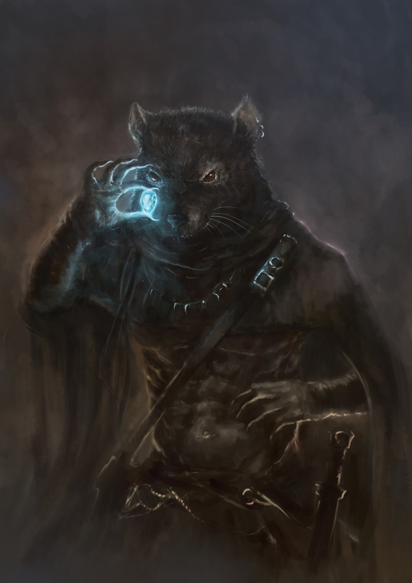

.. page:: stack margin=0.333in

----------------------------------------

.. section:: stack stack:columns=3 padding=8
.. title:: hidden
.. block:: style=title

Sherlock
========
 - **Sherlock** -- 18

.. block:: default style=default

Basic Information
 - **Player**: Graham
 - **Ancestry**: Ratfolk -- **Class**: Investigator
 - **Alignment**: Neutral Evil -- **Deity**: Lao Shu Po
 - **Languages**: Abyssal • Aklo • Auran • Celestial • Common • Daemonic • Draconic • Dwarven • Elven • Gnomish • Goblin • Halfling • Ignan • Infernal • Jotun • Kelish • Orcish • Osiriani • Protean • Terran • Tien • Undercommon • Ysoki
 - **Hero Points**: [X] [ ] [ ]
 - **Hits [240]**: `__________________________________________________`
 - `____________________________________________________________`
 - `____________________________________________________________`

.. title:: hidden
.. block:: thermometer thermometer:style=banner_green thermometer:rows=100 style=attributes

Ability Scores
 - **Strength**       |   -1 | *+8*
 - **Dexterity**      |    4 | *+19*
 - **Constitution**   |    4 | *+19*
 - **Wisdom**         |    4 | *+19*
 - **Intelligence**   |    6 | *+23*
 - **Charisma**       |    0 | *+10*

.. title:: hidden
.. block:: thermometer thermometer:style=banner_red thermometer:rows=100 style=attributes

Defenses
 - **Armor Class**    |     39
 - **Fortitude**      |     38
 - **Will**           |     42
 - **Reflex**         |     40
 - **Perception**     |     43

----------------------------------------

.. section:: stack padding=8 stack:columns=3
.. block:: default style=default

..

.. title:: banner style=banner

Movement
 - **Speed**: 30
 - **Burrow Speed**: 15

.. title:: banner style=banner_black
.. block:: style=back_black

+3 greater striking frost shock heavy crossbow
 - Range Attack
 - *#1*: **+31** doing **3d12+8 P +1d6 C +1d6 E**
 - *#2*: **+26** doing **3d12+8 P +1d6 C +1d6 E**
 - *#3*: **+21** doing **3d12+8 P +1d6 C +1d6 E**

.. title:: banner style=banner_black
.. block:: style=back_black

+2 striking ghost touch rapier
 - Melee Attack
 - *#1*: **+30** doing **2d6+5 P**
 - *#2*: **+25** doing **2d6+5 P**
 - *#3*: **+20** doing **2d6+5 P**

.. title:: banner style=banner_black
.. block:: style=back_black

Alchemist's fire, lesser
 - Range Attack
 - *#1*: **+28** doing **1d8+6 F +1 persistent Fire +1 Fire splash**
 - *#2*: **+23** doing **1d8+6 F +1 persistent Fire +1 Fire splash**
 - *#3*: **+18** doing **1d8+6 F +1 persistent Fire +1 Fire splash**

Skills
 -   **Acrobatics** -- **25** (T)
 -       **Arcana** -- **34** (L)
 -    **Athletics** -- **19** (T)
 -     **Crafting** -- **30** (M)
 -    **Deception** -- **20** (T)
 -        Diplomacy -- **0** (U)
 -     Intimidation -- **0** (U)
 -     **Medicine** -- **33** (L)
 -       **Nature** -- **26** (E)
 -    **Occultism** -- **27** (T)
 -      Performance -- **0** (U)
 -     **Religion** -- **28** (M)
 -      **Society** -- **34** (L)
 -      **Stealth** -- **33** (L)
 -     **Survival** -- **24** (T)
 -     **Thievery** -- **27** (M)
 - **Mercantile Lore** -- **26** (T)
 - **Absalom Lore** -- **26** (T)
 -   **Mzali Lore** -- **26** (T)

----------------------------------------

.. section:: stack padding=8 stack:columns=3 stack:equal
.. block:: default style=default

.. title:: banner style=banner_black
.. block:: style=back_black

↺ -- **Suspect of Opportunity (1/hour)**
 - **Trigger**: *A foe takes a hostile action against you in combat.* -- *Once per hour*
 - Sometimes something intrudes upon your case unexpectedly, such as an ambush sent to bring your investigation to a close. You’ve learned how to compartmentalize your main lead and pursue a new one for your current predicament. You Pursue a Lead against the triggering foe, setting aside but not ending one of your currently active leads, if you have two leads. At the end of the combat encounter, you stop Pursuing the Lead against the triggering foe and return to the original lead, if you have one.
 - -- Investigator -- 

.. title:: banner style=banner_green
.. block:: style=back_green

↺ -- **Clue In (1/10 minutes)**
 - **Trigger**: *Another creature attempts a check to investigate a lead you’re pursuing.* -- *Once per 10 minutes*
 - You share information with the triggering creature. They gain a circumstance bonus to their check equal to your circumstance bonus to checks investigating your subject from Pursue a Lead. The GM can add any relevant traits to this reaction depending on the situation, such as auditory and linguistic if you’re conveying information verbally.
 - -- Investigator • Concentrate -- 

.. title:: banner style=banner_green
.. block:: style=back_green

▶ -- **Devise a Stratagem (1/round)**
 -  -- *Once per round*
 - You assess a foe’s weaknesses in combat and use them to formulate a plan of attack against your enemy. Choose a creature you can see and roll a d20. If you Strike the chosen creature later this round, you must use the result of the roll you made to Devise a Stratagem for your Strike’s attack roll instead of rolling. You make this substitution only for the first Strike you make against the creature this round, not any subsequent attacks.
 - When you make this substitution, you can also add your Intelligence modifier to your attack roll instead of your Strength or Dexterity modifier, provided your Strike uses an agile or finesse melee weapon, an agile or finesse unarmed attack, a ranged weapon (which must be agile or finesse if it’s a melee weapon with the thrown trait), or a sap.
 - If you’re aware that the creature you choose is the subject of a lead you’re pursuing, you can use this ability as a free action.
 - -- Investigator • Concentrate • Fortune -- 

.. title:: banner style=banner_red
.. block:: style=back_red

▶▶ -- **Pass Without Trace (forest only, Constant)** -- *1*
 - **Duration**: 1 hour
 - You obscure the tracks you leave behind and make it harder for others to find you. The DC of checks to Track you gains a +4 status bonus or is equal to your spell DC, whichever results in a higher DC. You can benefit from only one pass without trace spell at a time.
 - -- Abjuration -- 

.. title:: banner style=banner_red
.. block:: style=back_red

▶▶▶ -- **Summon Elemental (1/day)** -- *2→4*
 - **Range**: 30 feet 
 - **Duration**: sustained up to 1 minute
 - You conjure an elemental to fight for you. This works like summon animal, except you summon a common creature that has the elemental trait and whose level is 1 or lower.
 - **Heightened (3Rd) Level 2.**
 - **Heightened (4th)**: Level 3.
 - -- Conjuration -- 

.. title:: banner style=banner_orange
.. block:: style=back_orange

▶▶▶ -- **Hat of the magi, greater**
 - This hat comes in many forms, such as a colorful turban or a pointy hat with a brim, and can bear symbols or runes. It grants you a +1 item bonus to Arcana checks and allows you to cast the prestidigitation cantrip as an arcane innate spell.
 - **Greater**
 - This larger, fancier hat grants a +2 bonus and can be activated.
 - **Activate**: ▶▶▶ Cast a Spell; Frequency once per day
 - **Effect**: You cast a 4th-level arcane summon elemental spell.
 - -- Conjuration • Arcane • Invested -- 

.. title:: banner style=banner_orange
.. block:: style=back_orange

▶ -- **Bag of holding II**
 - Though it appears to be a cloth sack decorated with panels of richly colored silk or stylish embroidery, a bag of holding opens into an extradimensional space larger than its outside dimensions. The Bulk held inside the bag doesn’t change the Bulk of the bag of holding itself. The amount of Bulk the bag’s extradimensional space can hold depends on its type.
 - You can Interact with the bag of holding to put items in or remove them just like a mundane sack. Though the bag can hold a great amount of material, an object still needs to be able to fit through the opening of the sack to be stored inside.
 - **Type Ii**
 - -- Conjuration • Extradimension • Magical -- 

.. title:: banner style=banner_red
.. block:: style=back_red

▶ -- **Hypercognition (1/hour)** -- *3*
 - You rapidly catalog and collate information relevant to your current situation. You can instantly use up to 6 Recall Knowledge actions as part of Casting this Spell. For these actions, you can’t use any special abilities, reactions, or free actions that trigger when you Recall Knowledge.
 - -- Divination -- 

.. title:: banner style=banner_orange
.. block:: style=back_orange

▶ -- **Diadem of intellect**
 - An elegant, colorful gem cut into a complex geometric pattern is slotted into a narrow metal band that fits around your brow. You gain a +3 item bonus to checks to Recall Knowledge, regardless of the skill. When you invest the diadem, you either increase your Intelligence score by 2 or increase it to 18, whichever would give you a higher score. This gives you additional trained skills and languages, as normal for increasing your Intelligence score. You must select skills and languages the first time you invest the item, and whenever you invest the same diadem of intellect, you get the same skills and languages you chose the first time.
 - **Activate**: ▶ envision; Frequency once per hour
 - **Effect**: You gain the effects of hypercognition
 - -- Divination • Apex • Invested • Magical -- 

.. title:: banner style=banner_red
.. block:: style=back_red

▶ -- **Guidance (At Will)** -- *1→9*
 - **Target**: 1 creature within 30 feet 
 - **Duration**: until the start of your next turn
 - You ask for divine guidance, granting the target a +1 status bonus to one attack roll, Perception check, saving throw, or skill check the target attempts before the duration ends. The target chooses which roll to use the bonus on before rolling. If the target uses the bonus, the spell ends. Either way, the target is then temporarily immune for 1 hour.
 - -- Divination • Cantrip -- 

.. title:: banner style=banner_red
.. block:: style=back_red

▶▶ -- **Telekinetic Projectile (At Will)** -- *1→9*
 - **Target**: 1 creature within 30 feet 
 - You hurl a loose, unattended object that is within range and that has 1 Bulk or less at the target. Make a spell attack roll against the target. If you hit, you deal bludgeoning, piercing, or slashing damage—as appropriate for the object you hurled—equal to 1d6 plus your spellcasting ability modifier. No specific traits or magic properties of the hurled item affect the attack or the damage.
 - **Heightened (+1)**: The damage increases by 1d6.
 - **Critical Success**: You deal double damage.
 - **Success**: You deal full damage.
 - -- Evocation • Arcane • Attack • Cantrip -- 

.. title:: banner style=banner_red
.. block:: style=back_red

▶▶ -- **Shocking Grasp** -- *1*
 - **Target**: 1 creature within touch 
 - You shroud your hands in a crackling field of lightning. Make a melee spell attack roll. On a hit, the target takes 2d12 electricity damage. If the target is wearing metal armor or is made of metal, you gain a +1 circumstance bonus to your attack roll with shocking grasp, and the target also takes 1d4 persistent electricity damage on a hit. On a critical hit, double the initial damage, but not the persistent damage.
 - **Heightened (+1)**: The damage increases by 1d12, and the persistent electricity damage increases by 1.
 - -- Evocation • Arcane • Attack • Electricity -- 

.. title:: banner style=banner_red
.. block:: style=back_red

▶▶▶ -- **Wall of Force** -- *6*
 - **Range**: 30 feet 
 - **Duration**: 1 minute
 - You form an invisible wall of pure magical force up to 50 feet long and up to 20 feet high. The wall has no discernible thickness. You must create the wall in an unbroken open space so its edges don’t pass through any creatures or objects, or the spell is lost. The wall has AC 10, Hardness 30, and 60 Hit Points, and it’s immune to critical hits and precision damage. The wall blocks physical effects from passing through it, and because it’s made of force, it blocks incorporeal and ethereal creatures as well. Teleportation effects can pass through the barrier, as can visual effects (since the wall is invisible).
 - Wall of force is immune to counteracting effects of its level or lower, but the wall is automatically destroyed by a disintegrate spell of any level or by contact with a rod of cancellation or sphere of annihilation.
 - **Heightened (+2)**: The Hit Points of the wall increases by 20.
 - -- Evocation • Arcane • Force -- 

.. title:: banner style=banner_red
.. block:: style=back_red

▶▶ -- **Searing Light (1/day)** -- *3→9*
 - **Target**: 1 creature within 120 feet 
 - You shoot a blazing ray of light tinged with holy energy. Make a ranged spell attack. The ray deals 5d6 fire damage. If the target is a fiend or undead, you deal an extra 5d6 good damage.
 - If the light passes through an area of magical darkness or targets a creature affected by magical darkness, searing light attempts to counteract the darkness. If you need to determine whether the light passes through an area of darkness, draw a line between yourself and the spell’s target
 - **Heightened (+1)**: The fire damage increases by 2d6, and the good damage against fiends and undead increases by 2d6.
 - **Critical Success**: The target takes double fire damage, as well as double good damage if a fiend or undead.
 - **Success**: The target takes full damage.
 - -- Evocation • Attack • Fire • Good • Light -- 

.. title:: banner style=banner_red
.. block:: style=back_red

▶▶ -- **Prestidigitation (At Will)** -- *1→9*
 - **Target**: 1 object (cook, lift, or tidy only) within 10 feet 
 - **Duration**: sustained
 - The simplest magic does your bidding. You can perform simple magical effects for as long as you Sustain the Spell. Each time you Sustain the Spell, you can choose one of four options.
 - `• Cook Cool, warm, or flavor 1 pound of nonliving material.`
 - `• Lift Slowly lift an unattended object of light Bulk or less 1 foot offthe ground.`
 - `• Make Create a temporary object of negligible Bulk, made of congealed magical substance. The object looks crude and artificial and is extremely fragile—it can’t be used as a tool, weapon, or spell component.`
 - `• Tidy Color, clean, or soil an object of light Bulk or less. You can affect an object of 1 Bulk with 10 rounds of concentration, and a larger object a 1 minute per Bulk.`
 - Prestidigitation can’t deal damage or cause adverse conditions. Any actual change to an object (beyond what is noted above) persists only as long as you Sustain the Spell.
 - -- Evocation • Cantrip -- 

.. title:: banner style=banner_red
.. block:: style=back_red

▶▶ -- **Invisibility (2/day)** -- *2→4*
 - **Target**: one creature within touch 
 - **Duration**: 10 minute
 - Cloaked in illusion, the target becomes invisible. This makes it undetected to all creatures, though the creatures can attempt to find the target, making it hidden to them instead (page 466). If the target uses a hostile action, the spell ends after that hostile action is completed.
 - **Heightened (4th)**: The spell lasts 1 minute, but it doesn’t end if the target uses a hostile action.
 - -- Illusion -- 

.. title:: banner style=banner_red
.. block:: style=back_red

▶▶ -- **Invisibility Sphere** -- *3*
 - **Target**: you and any number of creatures  in 10-foot aura 
 - **Duration**: 10 minutes
 - You and all targets are invisible except to each other as long as you remain within the spell’s area. If a creature made invisible by this spell leaves the spell’s area, it becomes visible and remains so even if it returns to the spell’s area. If any creature made invisible by this spell uses a hostile action, the spell ends after the hostile action is completed.
 - While exploring, it’s easy to move together slowly and remain invisible. This is untenable in a battle, however. Once an encounter begins, creatures remain invisible until at most the end of the  rst round, at which point the spell ends.
 - -- Illusion • Arcane -- 

.. title:: banner style=banner_red
.. block:: style=back_red

▶▶ -- **Blur** -- *2*
 - **Target**: 1 creature within touch 
 - **Duration**: 1 minute
 - The target’s form appears blurry. It becomes concealed. As the nature of this effect still leaves the target’s location obvious, the target can’t use this concealment to Hide or Sneak.
 - -- Illusion • Arcane • Visual -- 

.. title:: banner style=banner_red
.. block:: style=back_red

▶▶ -- **Ghost Sound (At Will)** -- *1→9*
 - **Range**: 30 feet 
 - **Duration**: sustained
 - You create an auditory illusion of simple sounds that has a maximum volume equal to four normal humans shouting. The sounds emanate from a square you designate within range. You can’t create intelligible words or other intricate sounds (such as music).
 - -- Illusion • Auditory • Cantrip -- 

.. title:: banner style=banner_orange
.. block:: style=back_orange

↺ -- **Snapleaf**
 - **Trigger**: *You begin to fall* -- 
 - This small, crystalline carving takes the shape of a tree leaf and attaches to armor or clothing with a simple strap. When you activate the snapleaf, you gain the benefits of feather fall and a 2nd-level invisibility spell for 1 minute or until you stop falling, whichever comes first.
 - -- Illusion • Consumable • Magical • Talisman -- 

.. title:: banner style=banner_orange
.. block:: style=back_orange

▶▶ -- **Cloak of elvenkind, greater**
 - This cloak is deep green with a voluminous hood, embroidered with gold trim and symbols significant in elven culture. The cloak allows you to cast the ghost sound cantrip as an arcane innate spell. When you adjust the cloak’s clasp (an Interact action), the cloak transforms to match the environment around you and muffles your sounds, granting you a +1 item bonus to Stealth checks.
 - **Activate**: ▶▶ Interact; Frequency once per day
 - **Effect**: You draw the hood up and gain the effects of invisibility, with the spell’s normal duration or until you pull the hood back down, whichever comes first. If you’re also wearing boots of elvenkind, you can activate this ability twice per day.
 - **Greater**
 - The cloak grants a +2 item bonus, and the effects of 4th-level invisibility. If you’re also wearing boots of elvenkind, the greater cloak of elvenkind allows you to Sneak in forest environments even when creatures are currently observing you.
 - -- Illusion • Invested • Magical -- 

.. title:: banner style=banner_red
.. block:: style=back_red

▶▶ -- **Blood Feast** -- *5*
 - **Target**: 1 creature within touch 
 - Your head splits vertically into an enormous maw, which feasts upon the target's blood, dealing 12d6 piercing damage, depending on your spell attack roll. After the spell, your head sews back together as if it had never split apart. You gain temporary Hit Points for 1 minute equal to half the piercing damage the target takes. If you are a gug, increase the piercing damage by 2d6 and increase the persistent bleed damage you deal on a critical hit by 1d8. This spell doesn’t alter a gug’s appearance.
 - **Heightened (+1)**: The piercing damage increases by 2d6, and the persistent bleed damage on a critical increases by 1.
 - **Critical Success**: The creature takes double damage and 1d8 persistent bleed damage.
 - **Success**: The creature takes full damage.
 - **Failure**: You miss and the creature takes no damage.
 - -- Necromancy • Arcane -- 

.. title:: banner style=banner_orange
.. block:: style=back_orange

◌ -- **Crying angel pendant**
 - **Trigger**: *You critically fail to Administer First Aid* -- 
 - When you activate this alabaster pendant, your critical failure becomes a normal failure instead.
 - -- Necromancy • Divine • Consumable • Talisman -- 

.. title:: banner style=banner_black
.. block:: style=back_black

▶▶▶ -- **Arrow of Death (1/day, DC 38)**
 -  -- *Once per day*
 - You modify an arrow or bolt to bring death to your target in a single potent hit. Make a bow Strike. On a hit, you deal an additional 10d10 precision damage. On a critical hit, the target must also succeed at a Fortitude saving throw against your class DC or spell DC, whichever is higher, or be immediately slain; this save has the death and incapacitation traits.
 - -- Necromancy • Archetype • Magical -- 

.. title:: banner style=banner_orange
.. block:: style=back_orange

▶ -- **Healing potion, moderate (3d8+10 HP)**
 - A healing potion is a vial of a ruby-red liquid that imparts a tingling sensation as the drinker’s wounds heal rapidly. When you drink a healing potion, you regain the listed number of Hit Points.
 - **Moderate**
 - The potion restores 3d8+10 Hit Points.
 - -- Necromancy • Consumable • Healing • Magical • Potion -- 

.. title:: banner style=banner_red
.. block:: style=back_red

▶▶ -- **Neutralize Poison** -- *3→6*
 - **Target**: 1 creature within touch 
 - You pour healing magic through the target in an attempt to cure one poison afflicting it. Attempt a counteract check against the poison.
 - -- Necromancy • Healing -- 

.. title:: banner style=banner_red
.. block:: style=back_red

– -- **Remove Disease** -- *3→6*
 - **Target**: 1 creature within touch 
 - **Duration**: 10 minutes
 - Healing magic purges disease from a creature’s body. You attempt to counteract one disease afflicting the target.
 - -- Necromancy • Healing -- 

.. title:: banner style=banner_orange
.. block:: style=back_orange

▶ -- **Healer’s gloves (1/day)**
 - These clean, white gloves never show signs of blood, even when used to stitch up wounds or treat other ailments. They give you a +1 item bonus to Medicine checks.
 - **Activate**: ▶ Interact; Frequency once per day
 - **Effect**: You can soothe a willing, adjacent creature’s wounds, restoring 2d6+7 Hit Points to that creature. This is a positive healing effect. You can’t harm undead with this healing.
 - -- Necromancy • Invested • Magical -- 

.. title:: banner style=banner_orange
.. block:: style=back_orange

▶ -- **Marvelous medicines, greater**
 - This set of healer’s tools contains a seemingly endless supply of bandages, herbs, and healing items of impeccable quality, granting you a +2 item bonus to Medicine checks.
 - **Activate**: ▶ Treat Poison or 8 hours (Treat Disease)
 - **Effect**: You can activate the tools when you use them to Treat Poison in order to produce the effects of neutralize poison, or when you Treat Disease in order to produce the effects of remove disease. Once these medicines have been used to treat a patient’s poison or disease, they can’t be used again to treat the same affliction for that patient.
 - **Type Greater**
 - The tools grant a +3 item bonus, and the spells are heightened to 6th level.
 - -- Necromancy • Magical -- 

.. title:: banner style=banner_red
.. block:: style=back_red

▶▶ -- **Fly** -- *4*
 - **Target**: 1 creature within touch 
 - **Duration**: 5 minutes
 - The target can soar through the air, gaining a fly Speed equal to its Speed or 20 feet, whichever is greater.
 - -- Transmutation • Arcane -- 

.. title:: banner style=banner_orange
.. block:: style=back_orange

▶▶ -- **Reflection of Light**
 - Your eyes are imbued with an inner light that is not visible externally but that provides you with darkvision and the ability to distinguish color in darkness. You can also focus this inner light to manifest as a brilliant beam of energy from your eyes.
 - **Activate**: ▶▶ envision; Frequency once per day
 - **Effect**: You cast searing light as an innate divine spell, heightened to a spell level equal to half your level rounded up.
 - -- Transmutation • Invested • Light • Magical -- 

.. title:: banner style=banner_orange
.. block:: style=back_orange

◌ -- **Boots of elvenkind, greater (1/hour)**
 - These tall, pointed boots are made from soft, supple black or green leather and are decorated with trim and buckles of gold. When worn, the boots allow you to move more nimbly, granting you a +1 item bonus to Acrobatics checks.
 - **Activate**: ◌ envision; Frequency once per hour
 - **Effect**: Until the end of your turn, you ignore difficult terrain when moving on the ground. If you’re wearing a cloak of elvenkind, you also gain a +5-foot status bonus to your land Speed until the end of your turn.
 - **Greater**
 - The boots grant a +2 bonus. If you’re also wearing a cloak of elvenkind, greater boots of elvenkind constantly grant the effects of pass without trace (DC 30) in forest environments.
 - -- Transmutation • Invested • Magical -- 

.. title:: banner style=banner_orange
.. block:: style=back_orange

▶▶ -- **Lifting belt**
 - This wide leather belt grants you a +1 item bonus to Athletics checks and increases the amount you can easily carry. You can carry Bulk equal to 6 + your Strength modifier before becoming encumbered, and you can hold and carry a total Bulk up to 11 + your Strength modifier.
 - **Activate ▶▶ Interact**
 - **Effect**: You lift an object of up to 8 Bulk as though it were weightless. This requires two hands, and if the object is locked or otherwise held in place, you can attempt to Force it Open using Athletics as part of this activation. The object still has its full weight and Bulk for all other purposes—you just ignore that weight. The effect lasts until the end of your next turn.
 - -- Transmutation • Invested • Magical -- 

.. title:: banner style=banner_black
.. block:: style=back_black

▶▶ -- **Archer's Aim**
 - You slow down, focus, and take a careful shot. Make a ranged Strike with a weapon in the bow weapon group. You gain a +2 circumstance bonus to the attack roll and ignore the target’s concealed condition. If the target is hidden, reduce the flat check from being hidden from 11 to 5.
 - -- Archetype • Concentrate -- 

.. title:: banner style=banner_black
.. block:: style=back_black

▶ -- **Trick Magic Item**
 - You examine a magic item you normally couldn’t use in an effort to fool it and activate it temporarily. For example, this might allow a fighter to cast a spell from a wand or allow a wizard to cast a spell that’s not on the arcane list using a scroll. You must know what activating the item does, or you can’t attempt to trick it.
 - **Success**: For the rest of the current turn, you can spend actions to activate the item as if you could normally use it.
 - **Failure**: You can’t use the item or try to trick it again this turn, but you can try again on subsequent turns.
 - **Critical Failure**: You can’t use the item, and you can’t try to trick it again until your next daily preparations.
 - -- General • Manipulate • Skill -- 

.. title:: banner style=banner_black
.. block:: style=back_black

↺ -- **Unexpected Shift**
 - **Trigger**: *You would take damage from an attack, spell, or other effect.* -- 
 - Your supernatural connection sometimes causes you to phase from reality when under threat, disappearing for split seconds before reappearing — often surprising you as much as your enemies. Roll a DC 16 flat check. On a success, you gain resistance to all damage equal to your level against the triggering effect, you gain a +2 circumstance bonus to saving throws against that effect until the start of your turn, and you gain the dazzled condition for 1 round.
 - -- Gnome -- 

.. title:: banner style=banner_green
.. block:: style=back_green

▶▶▶ -- **Eldritch Shot**
 - You Cast a Spell that takes 1 or 2 actions to cast and requires a spell attack roll. The effects of the spell do not occur immediately but are imbued into the bow you’re wielding. Make a Strike with that bow. Your spell flies with the ammunition, using your attack roll result to determine the effects of both the Strike and the spell. This counts as two attacks for your multiple attack penalty, but you don’t apply the penalty until after you’ve completed both attacks.

----------------------------------------

.. section:: stack padding=8 stack:columns=2
.. block:: default
.. title:: banner style=banner
.. block:: default style=default

Items
 - +2 greater fire resistant greater resilient major shadow leather armor
 - Wand of phantom steed (6th level)
 - Scroll of charitable urge
 - Scroll of magic missile (3rd level)
 - Scroll of lightning bolt
 - Scroll of faerie fire
 - Scroll of glitterdust
 - Pendant of the occult: Use guidance as an innate occult spell.
 - Scroll of searing light (8th level)
 - Scroll of dimension door (5th level)
 - Scroll of haste
 - Scroll of heroism
 - Cold iron bolts
 - Ghost arrow
 - Beacon shot bolt
 - Cat’s eye elixir
 - Thieves' tools, infiltrator
 - Spyglass, fine
 - Manacles, average

General Abilities
 - **Low-Light Vision**: See in dim light as if it were normal light.
 - **Scent (imprecise) 30 feet**: Sense creatures or objects by smell.
 - **Pursue a Lead (1/10 minutes)**
 - **Strategic Strike (5d6)**: On Strike with Int due to Devising a Stratagem, deal extra precision damage.
 - **Methodology**
 - **Keen Recollection**: When Recall Knowledge with untrained skills, use Proficiency bonus equal to own level instead of +0.
 - **Investigator Expertise**: Pursue a Lead bonus increases to +2 and your proficiency rank for your investigator class DC increases to expert.
 - **Deductive Improvisation**: Can attempt trained checks while untrained, expert checks while trained, and master checks while expert.
 - **Resolve**: Successes rolled on Will saves are crit successes instead.
 - **Evasion**: Successes rolled on Reflex saves are crit successes instead.
 - **Greater Resolve**: Crit failures on Will saves are failures instead. Half damage on failed Will saves vs. damaging effects.
 - **Alchemical Sciences (8 vials/day)**
 - **Darkvision**: You can see in the dark (black and white only).
 - **Signature Spells**

Ancestry Feats
 - **Rat Familiar**: You gain a familiar using the rules on page 217 of the Core Rulebook, and this familiar must be a rat
 - **Fortuitous Shift**: Flat check DC of your Fortuitous Shift feat decreases to 11, and you are no longer dazzled if you succeed.
 - **Warren Digger**: You gain a burrow Speed of 15 feet
 - **Uncanny Cheeks**: Gain the Prescient Consumable and Prescient Planner feats, item must fit in your cheeks.
 - **Gnome Polyglot**: Learn three common or uncommon languages of your choice.
 - **Longsnout Rat**: You gain imprecise scent with a range of 30 feet and gain a +2 on Perception to Seek a creature or object in range

Class Feats
 - **Archaeologist Dedication**: +1 circumstance bonus to Recall Knowledge about ancient history, peoples, and cultures
 - **Alchemical Discoveries**: Learn more alchemical item formulas each level, and can create extra versatile vials based on proficiency level in Crafting.
 - **Settlement Scholastics**: Become an expert in a Lore skill about a specific settlement and if already trained in that lore become trained in another. Choose single common or uncommon language in that settement and learn it
 - **Settlement Scholastics**: Become an expert in a Lore skill about a specific settlement and if already trained in that lore become trained in another. Choose single common or uncommon language in that settement and learn it
 - **Archer Dedication**: Trained in simple/martial bow weapons and gain access to critcal specialization bow effects if you are an expert.
 - **Crossbow Terror**: Crossbows gain a +2 dam and if a simple weapon, +1 to damage die size.
 - **Eldritch Archer Dedication (Arcane)**: You blend magic with your archery, leading to powerful results.
 - **Basic Eldritch Archer Spellcasting**: You gain the basic spellcasting benefits
 - **Expert Eldritch Archer Spellcasting**: You gain the expert spellcasting benefits.

General Feats
 - **Adopted Ancestry (Gnome)**: Gain access to a selected ancestry's feats.
 - **Fleet**: Your Speed increases by 5 feet.
 - **Prescient Consumable**: Prescient Planner can now produce consumables with the same limits on level, rarity, and bulk.
 - **Prescient Planner**: 1 min to produce adventuring gear hadn't previously declared. Must be common, level max half your level, and not so bulky it would have encumbered you previously.
 - **Ancestral Paragon**: Gain a 1st-level ancestry feat.
 - **Toughness**: The DC of recovery checks is equal to 9 + your dying condition value.

Skill Feats
 - **Alchemical Crafting**: Use the Craft activity to create alchemical items.
 - **Read Lips**: You can read the lips of others nearby who you can clearly see but you're fascinated and flat-footed.
 - **Streetwise**: Use Society to Gather Information or use Recall Knowledge in a settlement you frequent regularly.
 - **Criminal Connections**: In area where have connections, roll Society (GM decides DC) to meet important criminal or gain a favor in return for future favor of contacts choice.
 - **Foil Senses**: When using Avoid Notice/Hide/Sneak actions, you are always considered to be taking precautions against special senses.
 - **Quick Contacts**: When enter new settlement, only 1 day to build connections enough to use Connections or Underworld Connections.
 - **Swift Sneak**: Move full speed when you Sneak including when you Burrow, Climb, Fly or Swim.
 - **Biographical Eye**: Roll Society (DC 30) after 1 min interact on first meeting to gain info on origin and history in society. Must beat Will DC to see through false identity.
 - **Robust Recovery**: When you Treat a Disease/Poison increase the circumstance bonus granted on a success is +4 and if the patient’s saving throw is a success, the patient gets a critical success.
 - **Multilingual**: Learn additional common or uncommon languages of your choice.
 - **Armored Stealth**: Noisy armor loses noisy trait, non-noisy reduces check penalty for Stealth by 1 (2 at master, 3 at legendary).
 - **Legendary Sneak**: You can Hide and Sneak even without cover or being concealed and you always gain the benefits of the Avoiding Notice in exploration mode.
 - **Legendary Medic**: 1/day per target spend 1hr to remove a disease or the blinded, deafened, doomed, drained, or enervated condition.
 - **Multilingual**: Learn additional common or uncommon languages of your choice.
 - **Legendary Codebreaker**: Decipher Writing while reading at normal speed. If you spend the full amount of time that's ordinarily required, treat a success as a critical success; if you critically succeed you gain a nearly word-for-word understanding of the document.
 - **Unified Theory**: Whenever you use an action/skill feat that requires a tradition check, you can use Arcana instead.

----------------------------------------

Styles
------

default
    family=Gotham size=8 align=left 
quote
    family=Baskerville size=7 align=center italic color=#020 opacity=0.8
heavy
    bold color=black opacity=1
title
    size=28 color=navy 

banner
    background=#88c color=white
banner_green
    inherit=banner background=green=
banner_red
    inherit=banner background=red
banner_black
    inherit=banner background=black
banner_orange
    inherit=banner background=orange

back
    size=8 family=Helvetica opacity=0.75 align=fill
back_blue
    inherit=back background=#eef  borderColor=#88f
back_orange
    inherit=back background=#fec borderColor=#fe8
back_green
    inherit=back background=#efe borderColor=#7a7
back_red
    inherit=back background=#fee borderColor=#f88
back_black
    inherit=back background=#eee borderColor=#888

attributes
    color=white family=Helvetica size=10
